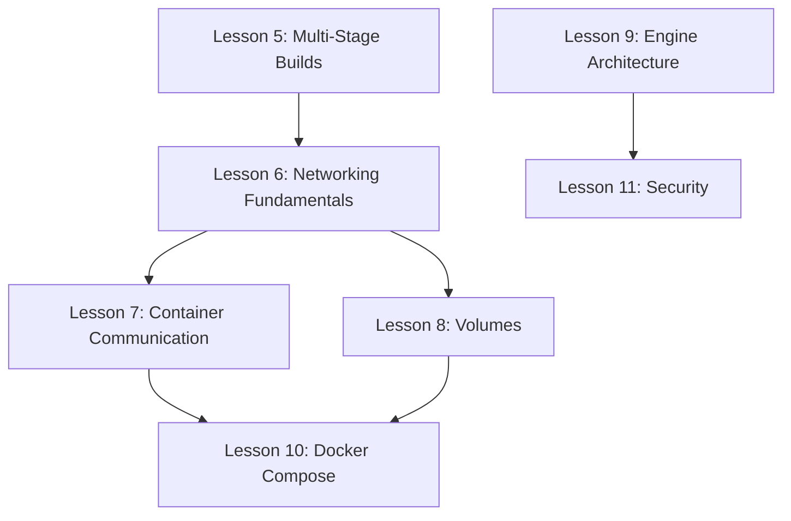

# Implementation Plan: Docker Chapter 49 Expansion

**Branch**: `014-docker-networking-volumes` | **Date**: 2025-12-23 | **Spec**: [spec.md](./spec.md)
**Input**: Feature specification from `/specs/014-docker-networking-volumes/spec.md`

## Summary

Expand Docker Chapter 49 from 10 lessons to 14 lessons by adding 4 new L1 (Manual Foundation) lessons covering networking, volumes, and Docker Engine architecture. These topics fill critical gaps identified from Docker Deep Dive book analysis.

## Technical Context

**Content Type**: Educational lessons (Markdown/MDX)
**Teaching Layer**: L1 (Manual Foundation) for all 4 new lessons
**Proficiency Level**: B1 (7-10 concepts, moderate scaffolding)
**Target Platform**: Docusaurus 3.x documentation site
**Prerequisites**: Docker lessons 1-5 (Installation through Multi-Stage Builds)
**Constraints**: Constitutional compliance (framework invisibility, evidence presence, proper endings)

## Constitution Check

*GATE: Must pass before implementation.*

| Gate | Status | Notes |
|------|--------|-------|
| Layer 1 appropriate? | ✅ PASS | New concepts requiring mental model before AI assistance |
| Proficiency tier matches? | ✅ PASS | B1 (7-10 concepts) appropriate for intermediate Docker |
| Framework invisibility? | ✅ Will validate | No exposed pedagogical labels in content |
| Evidence presence? | ✅ Will validate | All code blocks will have output sections |
| Proper endings? | ✅ Will validate | All lessons end with "Try With AI" only |

## Project Structure

### Documentation (this feature)

```text
specs/014-docker-networking-volumes/
├── spec.md              # Feature specification ✅
├── plan.md              # This file ✅
└── tasks.md             # Task breakdown (next step)
```

### Content Files (repository)

```text
apps/learn-app/docs/07-AI-Cloud-Native-Development/49-docker-for-ai-services/
├── README.md                              # Updated chapter overview
├── 01-docker-installation-setup.md        # Existing (unchanged)
├── 02-container-fundamentals.md           # Existing (unchanged)
├── 03-writing-your-first-dockerfile.md    # Existing (unchanged)
├── 04-container-lifecycle-debugging.md    # Existing (unchanged)
├── 05-multi-stage-builds-optimization.md  # Existing (unchanged)
├── 06-docker-networking-fundamentals.md   # NEW - Bridge, port mapping, DNS
├── 07-container-to-container-comm.md      # NEW - User networks, service discovery
├── 08-volumes-persistent-data.md          # NEW - Named volumes, bind mounts
├── 09-docker-engine-architecture.md       # NEW - containerd, runc, OCI
├── 10-docker-compose-development.md       # RENAMED from 06-*
├── 11-security-best-practices.md          # RENAMED from 07-*
├── 12-ai-assisted-docker-gordon.md        # RENAMED from 08-*
├── 13-capstone-production-ready-agent.md  # RENAMED from 09-*
└── 14-building-production-dockerfile-skill.md  # RENAMED from 10-*
```

## Lesson Architecture

### New Lesson 6: Docker Networking Fundamentals

**Layer**: L1 (Manual Foundation)
**Duration**: 30 minutes
**Concepts** (7):
1. Container Network Model (CNM)
2. Bridge network driver
3. Port mapping syntax (-p host:container)
4. Container DNS resolution
5. Network inspection commands
6. Host network mode
7. Network driver types (bridge, host, none)

**Key Exercises**:
- Map container port to host, access from browser
- Inspect bridge network, understand IP assignment
- Demonstrate DNS limitation on default bridge

---

### New Lesson 7: Container-to-Container Communication

**Layer**: L1 (Manual Foundation)
**Duration**: 30 minutes
**Concepts** (6):
1. User-defined networks
2. Automatic DNS service discovery
3. Network isolation
4. Container aliases
5. Connecting/disconnecting networks at runtime
6. Multi-network containers

**Key Exercises**:
- Create user-defined network
- Launch two containers, communicate by name
- Demonstrate cross-network isolation

---

### New Lesson 8: Volumes and Persistent Data

**Layer**: L1 (Manual Foundation)
**Duration**: 35 minutes
**Concepts** (8):
1. Container ephemeral filesystem
2. Named volumes
3. Bind mounts
4. tmpfs mounts
5. Volume lifecycle (create, inspect, rm, prune)
6. Volume drivers
7. AI model storage patterns
8. Development vs production volume strategies

**Key Exercises**:
- Demonstrate data loss without volumes
- Create named volume, persist data across container lifecycle
- Bind mount for development workflow
- Design volume strategy for AI service (models, embeddings, logs)

---

### New Lesson 9: Docker Engine Architecture

**Layer**: L1 (Manual Foundation)
**Duration**: 25 minutes
**Concepts** (6):
1. Docker CLI
2. Docker daemon (dockerd)
3. containerd
4. runc
5. OCI specifications (image, runtime)
6. Alternative runtimes (gVisor, Kata)

**Key Exercises**:
- Trace docker run execution path
- Inspect containerd processes
- Understand component responsibilities

## Dependencies



## Implementation Strategy

### Phase 1: File Renaming (Sequential)
Rename existing lessons 6-10 to 10-14 to make room for new content.

### Phase 2: New Content Creation (Parallel)
Create 4 new lessons using content-implementer subagents.

**Critical Execution Rules** (learned from K8s expansion):
- Each prompt specifies exact absolute output path
- Include "Execute autonomously without waiting for confirmation"
- Include "DO NOT create new directories unless explicitly specified"
- Verify target directory exists before launching

### Phase 3: README Update
Update chapter README with 14-lesson structure and updated 4-Layer progression.

### Phase 4: Validation
Run constitutional validation on all new lessons.

## Parallel Execution Plan

| Agent | Lesson | Can Parallel? |
|-------|--------|---------------|
| Agent 1 | Lesson 6 (Networking) | ✅ Yes |
| Agent 2 | Lesson 7 (Communication) | ✅ Yes |
| Agent 3 | Lesson 8 (Volumes) | ✅ Yes |
| Agent 4 | Lesson 9 (Architecture) | ✅ Yes |

All 4 lessons can be generated in parallel—they have no content dependencies on each other.

## Risk Mitigation

| Risk | Mitigation |
|------|------------|
| Subagent confirmation deadlock | Explicit "Execute autonomously" in every prompt |
| Wrong directory | Absolute paths, verify with `ls` before launching |
| Missing outputs | All code blocks must have **Output:** sections |
| Framework exposure | Post-generation grep check for forbidden patterns |
